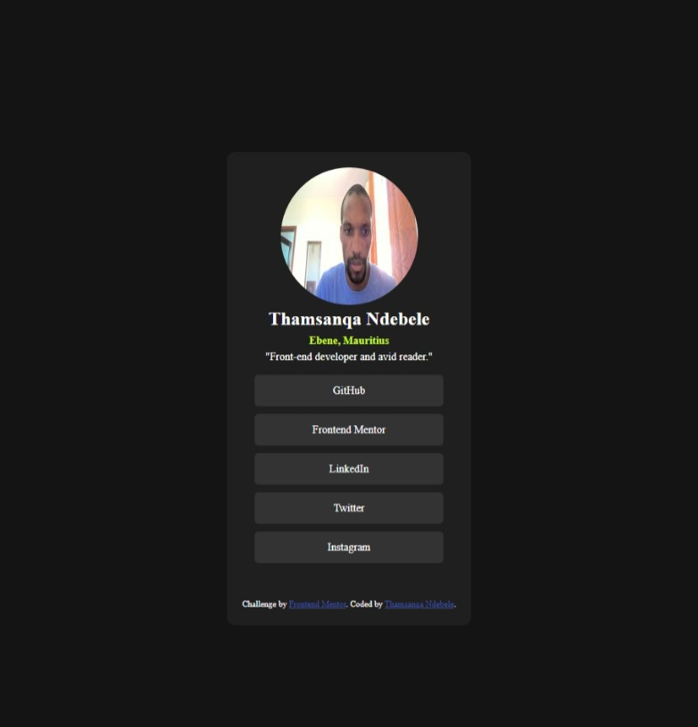

# Frontend Mentor - Social links profile solution

This is a solution to the [Social links profile challenge on Frontend Mentor](https://www.frontendmentor.io/challenges/social-links-profile-UG32l9m6dQ). Frontend Mentor challenges help you improve your coding skills by building realistic projects. 

## Table of contents

- [Overview](#overview)
  - [The challenge](#the-challenge)
  - [Screenshot](#screenshot)
  - [Links](#links)
- [My process](#my-process)
  - [Built with](#built-with)
- [Author](#author)

**Note: Delete this note and update the table of contents based on what sections you keep.**

## Overview

### The challenge

Users should be able to:

- See focus states for all interactive elements on the page

### Screenshot

### Links

- [Solution URL](https://github.com/thamu-acn/social-links-profile)
- [Live site URL](https://thamu-acn.github.io/social-links-profile/)

## My process

- Adding HTML to create structure.
- Adding CSS styles to layout the content

### Built with

- Semantic HTML5 markup
- CSS custom properties
- Flexbox

## Author

- Name - Thamsanqa Ndebele
- Frontend Mentor - [@thamu-acn](https://www.frontendmentor.io/profile/thamu-acn)
- LinkedIn - [Thamsanqa Ndebele](https://www.linkedin.com/in/thamsanqa-ndebele-12988487/)
